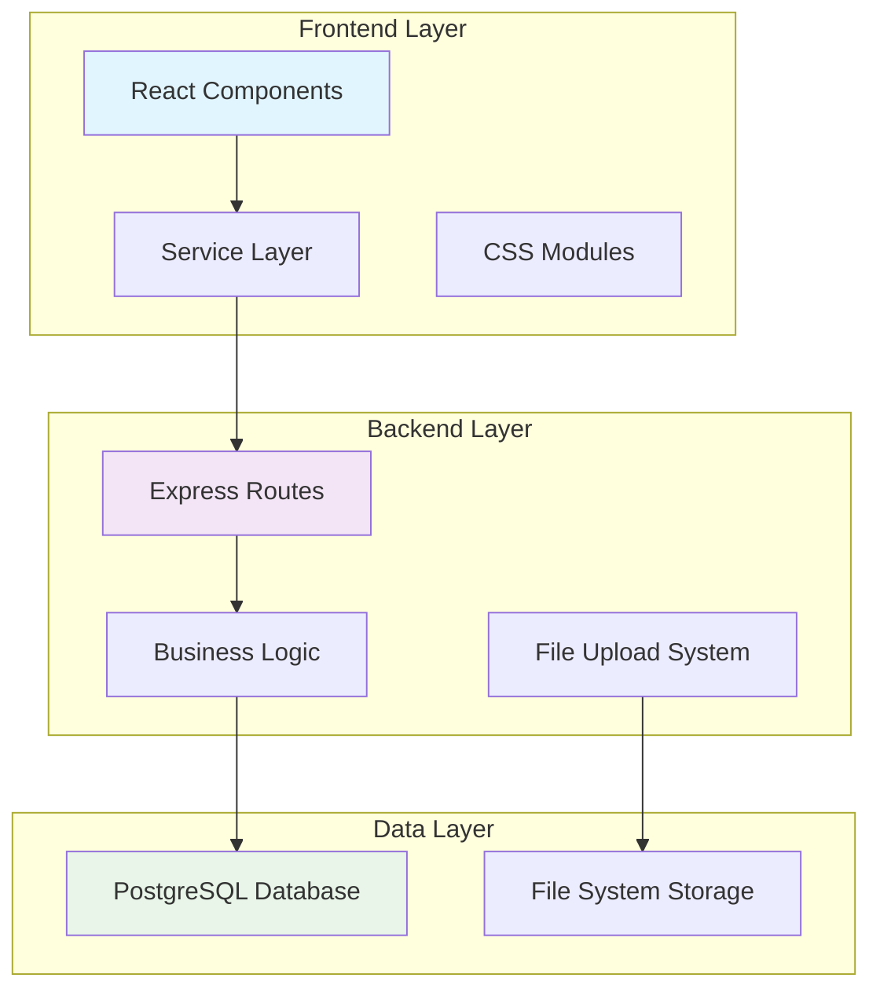

# Design Document

## Overview

This design addresses critical bugs and improvements in the Tripful travel booking application. The solution focuses on fixing package addition functionality, modernizing the UI, cleaning up the codebase, and implementing robust error handling. The approach prioritizes immediate bug fixes while establishing a foundation for long-term maintainability.

## Architecture

The application maintains its existing three-tier architecture:



### Key Architectural Improvements

1. **Separation of Concerns**: Clear boundaries between UI, business logic, and data layers
2. **Error Boundary Implementation**: Comprehensive error handling at each layer
3. **File Upload Pipeline**: Secure, validated file processing workflow
4. **Database Transaction Management**: Atomic operations for data consistency

## Components and Interfaces

### 1. Package Management System

**Enhanced Package Controller**
```typescript
interface PackageController {
  create(packageData: PackageFormData, file?: File): Promise<Package>
  update(id: string, packageData: PackageFormData, file?: File): Promise<Package>
  uploadImage(file: File): Promise<ImageUploadResult>
  validatePackageData(data: PackageFormData): ValidationResult
}
```

**File Upload Service**
```typescript
interface FileUploadService {
  validateFile(file: File): ValidationResult
  createUploadDirectory(): Promise<void>
  saveFile(file: File, destination: string): Promise<string>
  generateUniqueFilename(originalName: string): string
}
```

### 2. Enhanced UI Components

**Modern Staff Dashboard**
```typescript
interface StaffDashboard {
  PackageForm: React.Component<PackageFormProps>
  PackageTable: React.Component<PackageTableProps>
  ImageUploader: React.Component<ImageUploaderProps>
  ErrorBoundary: React.Component<ErrorBoundaryProps>
}
```

**Responsive Form System**
```typescript
interface FormComponents {
  FormField: React.Component<FormFieldProps>
  FileInput: React.Component<FileInputProps>
  ValidationMessage: React.Component<ValidationProps>
  LoadingSpinner: React.Component<LoadingProps>
}
```

### 3. Database Interface Layer

**Package Repository**
```typescript
interface PackageRepository {
  create(packageData: PackageData): Promise<Package>
  update(id: string, updates: Partial<PackageData>): Promise<Package>
  findById(id: string): Promise<Package | null>
  findAll(filters?: PackageFilters): Promise<Package[]>
  deactivate(id: string): Promise<Package>
}
```

## Data Models

### Enhanced Package Model

```typescript
interface Package {
  id: string
  title: string
  destination: string
  location?: string
  image_url?: string
  description?: string
  flight_summary: string
  hotel_name: string
  hotel_rating: number (1-5)
  duration_days: number
  price: number
  available_slots: number
  start_date: Date
  end_date: Date
  is_active: boolean
  created_by: string
  created_at: Date
  updated_at: Date
}
```

### File Upload Model

```typescript
interface FileUpload {
  originalName: string
  filename: string
  mimetype: string
  size: number
  destination: string
  path: string
  uploadedAt: Date
}
```

### Validation Models

```typescript
interface ValidationResult {
  isValid: boolean
  errors: ValidationError[]
}

interface ValidationError {
  field: string
  message: string
  code: string
}
```

## Correctness Properties

*A property is a characteristic or behavior that should hold true across all valid executions of a system-essentially, a formal statement about what the system should do. Properties serve as the bridge between human-readable specifications and machine-verifiable correctness guarantees.*

Let me analyze the acceptance criteria to determine testable properties:

### Converting EARS to Properties

Based on the prework analysis, I'll convert the testable acceptance criteria into universally quantified properties:

**Property 1: Package Creation Success**
*For any* valid package data with all required fields, the Package_Manager should successfully create the package and return the created package object
**Validates: Requirements 1.1**

**Property 2: File Upload Directory Creation**
*For any* valid image file upload, the Upload_System should store the file in the uploads/packages directory structure
**Validates: Requirements 1.2**

**Property 3: Package Creation Error Handling**
*For any* invalid package data, the Package_Manager should return descriptive error messages indicating the specific validation failures
**Validates: Requirements 1.3**

**Property 4: Package Data Persistence**
*For any* successfully created package, retrieving the package from the database should return all the original data including image references
**Validates: Requirements 1.4**

**Property 5: Upload Directory Initialization**
*For any* file upload operation, if the uploads/packages directory doesn't exist, the Upload_System should create it before storing files
**Validates: Requirements 1.5**

**Property 6: CSS Consistency**
*For any* CSS file in the application, color values and typography declarations should use consistent values throughout the codebase
**Validates: Requirements 3.4**

**Property 7: Responsive Layout Behavior**
*For any* viewport size between 320px and 1920px width, the application should maintain usable layouts without horizontal scrolling
**Validates: Requirements 3.5**

**Property 8: SQL Parameter Safety**
*For any* package update operation, the generated SQL query should use proper parameterized placeholders to prevent injection
**Validates: Requirements 4.1**

**Property 9: Database Schema Compatibility**
*For any* package creation with valid required and optional fields, the database should accept and store all provided data
**Validates: Requirements 4.2**

**Property 10: File System Directory Management**
*For any* file upload operation, the Upload_System should ensure proper directory structure exists before file operations
**Validates: Requirements 4.3**

**Property 11: Input Validation Before Database**
*For any* package data input, validation should occur and reject invalid data before any database operations are attempted
**Validates: Requirements 4.4**

**Property 12: Database Error Response Quality**
*For any* database operation failure, the Package_Manager should return user-friendly error messages without exposing internal details
**Validates: Requirements 4.5**

**Property 13: UI Error Message Display**
*For any* package creation failure, the Staff_Dashboard should display specific error messages corresponding to the validation failures
**Validates: Requirements 6.1**

**Property 14: File Upload Error Feedback**
*For any* invalid file upload attempt, the Upload_System should provide clear feedback about file type, size, or format requirements
**Validates: Requirements 6.2**

**Property 15: Database Error Logging and User Feedback**
*For any* database operation failure, the application should log the technical error details while showing user-friendly messages to the interface
**Validates: Requirements 6.3**

**Property 16: Authentication Redirect Behavior**
*For any* authentication failure, the application should redirect users to the appropriate login page with proper error context
**Validates: Requirements 6.4**

**Property 17: Network Error Graceful Handling**
*For any* network request failure, the application should handle the error gracefully and provide retry options where appropriate
**Validates: Requirements 6.5**

**Property 18: Edit Form Data Population**
*For any* package edit operation, the Staff_Dashboard should pre-populate all form fields with the existing package data
**Validates: Requirements 7.1**

**Property 19: Image Preview Display**
*For any* image file selection in upload forms, the Staff_Dashboard should display a preview of the selected image
**Validates: Requirements 7.2**

**Property 20: Bulk Operations Functionality**
*For any* selection of multiple packages, the Staff_Dashboard should provide bulk operations that work correctly across all selected items
**Validates: Requirements 7.3**

**Property 21: Image Replacement Data Preservation**
*For any* package image update operation, all other package data should remain unchanged after the image replacement
**Validates: Requirements 7.4**

**Property 22: Package Deactivation Referential Integrity**
*For any* package deactivation operation, all related booking and payment data should remain intact and accessible
**Validates: Requirements 7.5**

**Property 23: Package List Load Performance**
*For any* package list request, the response should be delivered within 2 seconds under normal network conditions
**Validates: Requirements 8.1**

**Property 24: Upload Progress Feedback**
*For any* file upload operation, the Staff_Dashboard should display progress indicators during the upload process
**Validates: Requirements 8.2**

**Property 25: API Call Efficiency**
*For any* user interaction sequence, the application should minimize redundant API calls and cache appropriate data
**Validates: Requirements 8.4**

**Property 26: Large Dataset Pagination**
*For any* dataset with more than 50 items, the application should implement pagination or virtual scrolling to maintain performance
**Validates: Requirements 8.5**

## Error Handling

### Error Classification System

```typescript
enum ErrorType {
  VALIDATION_ERROR = 'VALIDATION_ERROR',
  DATABASE_ERROR = 'DATABASE_ERROR',
  FILE_UPLOAD_ERROR = 'FILE_UPLOAD_ERROR',
  NETWORK_ERROR = 'NETWORK_ERROR',
  AUTHENTICATION_ERROR = 'AUTHENTICATION_ERROR',
  AUTHORIZATION_ERROR = 'AUTHORIZATION_ERROR',
  SYSTEM_ERROR = 'SYSTEM_ERROR'
}

interface ApplicationError {
  type: ErrorType
  code: string
  message: string
  details?: any
  timestamp: Date
  requestId?: string
}
```

### Error Handling Strategy

1. **Input Validation Layer**: Validate all inputs before processing
2. **Business Logic Layer**: Handle domain-specific errors with context
3. **Data Access Layer**: Transform database errors to application errors
4. **Presentation Layer**: Display user-friendly error messages
5. **Logging Layer**: Comprehensive error logging for debugging

### File Upload Error Handling

```typescript
interface FileUploadError extends ApplicationError {
  filename?: string
  fileSize?: number
  allowedTypes: string[]
  maxSize: number
}
```

**Error Scenarios:**
- File too large (>5MB)
- Invalid file type (not image/jpeg, image/png, image/webp)
- Missing upload directory
- Disk space insufficient
- File corruption during upload

## Testing Strategy

### Dual Testing Approach

The testing strategy combines unit tests for specific scenarios with property-based tests for comprehensive coverage:

**Unit Tests Focus:**
- Specific error conditions and edge cases
- Integration points between components
- Mock external dependencies for isolated testing
- Regression tests for previously fixed bugs

**Property-Based Tests Focus:**
- Universal properties across all valid inputs
- Comprehensive input coverage through randomization
- Validation of business rules under various conditions
- Performance characteristics under load

### Property-Based Testing Configuration

- **Testing Framework**: Use fast-check for JavaScript/TypeScript property-based testing
- **Test Iterations**: Minimum 100 iterations per property test
- **Test Tagging**: Each property test tagged with format: **Feature: application-fixes-and-improvements, Property {number}: {property_text}**
- **Data Generators**: Custom generators for Package data, File uploads, and User interactions
- **Shrinking Strategy**: Automatic test case minimization on failure

### Testing Implementation Plan

1. **Package Management Tests**
   - Property tests for package CRUD operations
   - Unit tests for specific validation rules
   - Integration tests for file upload workflows

2. **UI Component Tests**
   - Property tests for responsive behavior
   - Unit tests for form validation
   - Visual regression tests for styling consistency

3. **Database Integration Tests**
   - Property tests for data persistence
   - Unit tests for SQL query correctness
   - Transaction rollback tests for error scenarios

4. **File Upload Tests**
   - Property tests for various file types and sizes
   - Unit tests for security validation
   - Integration tests for directory management

### Performance Testing

- **Load Testing**: Simulate concurrent package creation and file uploads
- **Stress Testing**: Test system behavior under resource constraints
- **Performance Monitoring**: Track response times and resource usage
- **Benchmark Testing**: Establish performance baselines for regression detection

## Implementation Phases

### Phase 1: Critical Bug Fixes (Priority 1)
1. Fix package creation SQL parameter issue
2. Create upload directory structure
3. Remove unnecessary dependencies
4. Fix git tracking issues

### Phase 2: UI Modernization (Priority 2)
1. Update CSS styling without CSS variables
2. Implement responsive design improvements
3. Add loading states and progress indicators
4. Enhance error message display

### Phase 3: Enhanced Features (Priority 3)
1. Add bulk operations for package management
2. Implement image preview functionality
3. Add performance optimizations
4. Implement comprehensive error logging

### Phase 4: Testing and Validation (Priority 4)
1. Implement property-based test suite
2. Add comprehensive unit tests
3. Performance testing and optimization
4. Security audit and validation

## Security Considerations

### File Upload Security
- **File Type Validation**: Strict MIME type checking
- **File Size Limits**: Maximum 5MB per file
- **Filename Sanitization**: Remove dangerous characters
- **Virus Scanning**: Integration with antivirus APIs
- **Storage Isolation**: Uploaded files stored outside web root

### SQL Injection Prevention
- **Parameterized Queries**: All database operations use prepared statements
- **Input Sanitization**: Validate and sanitize all user inputs
- **Least Privilege**: Database user has minimal required permissions

### Authentication and Authorization
- **JWT Token Validation**: Verify token integrity and expiration
- **Role-Based Access Control**: Enforce staff/admin permissions
- **Session Management**: Secure session handling and cleanup

## Deployment Considerations

### Environment Configuration
- **Environment Variables**: Secure configuration management
- **Database Migrations**: Automated schema updates
- **File System Permissions**: Proper upload directory permissions
- **Process Management**: Graceful shutdown and restart handling

### Monitoring and Logging
- **Application Logs**: Structured logging with correlation IDs
- **Error Tracking**: Integration with error monitoring services
- **Performance Metrics**: Response time and resource usage tracking
- **Health Checks**: Automated system health monitoring